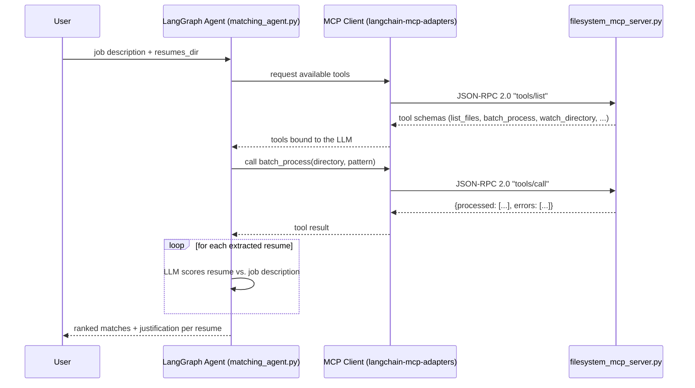
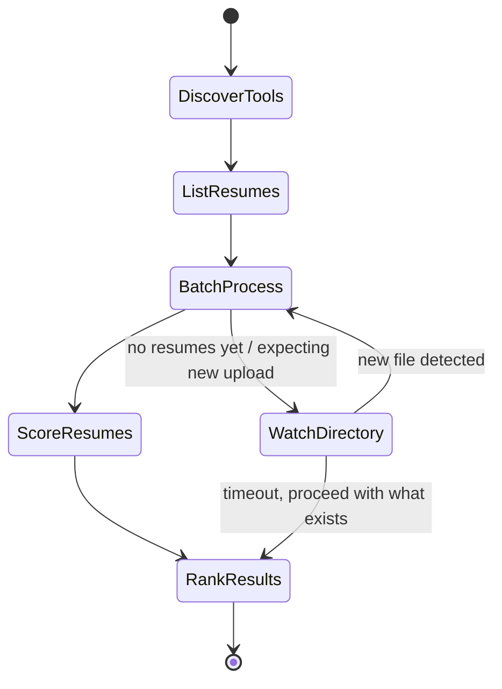
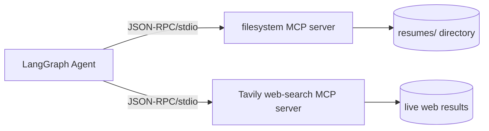

# Agent ↔ MCP Workflow

## Sequence diagram: a single matching run

```mermaid
sequenceDiagram
    participant U as User
    participant A as LangGraph Agent (matching_agent.py)
    participant M as MCP Client (langchain-mcp-adapters)
    participant S as filesystem_mcp_server.py

    U->>A: job description + resumes_dir
    A->>M: request available tools
    M->>S: JSON-RPC 2.0 "tools/list"
    S-->>M: tool schemas (list_files, batch_process, watch_directory, ...)
    M-->>A: tools bound to the LLM

    A->>M: call batch_process(directory, pattern)
    M->>S: JSON-RPC 2.0 "tools/call"
    S-->>M: {processed: [...], errors: [...]}
    M-->>A: tool result

    loop for each extracted resume
        A->>A: LLM scores resume vs. job description
    end

    A-->>U: ranked matches + justification per resume
```

## State machine: agent decision flow

```mermaid
stateDiagram-v2
    [*] --> DiscoverTools
    DiscoverTools --> ListResumes
    ListResumes --> BatchProcess
    BatchProcess --> ScoreResumes
    ScoreResumes --> RankResults
    RankResults --> [*]

    BatchProcess --> WatchDirectory: no resumes yet / expecting new upload
    WatchDirectory --> BatchProcess: new file detected
    WatchDirectory --> RankResults: timeout, proceed with what exists
```

## Multi-MCP (Part B bonus)

```mermaid
flowchart LR
    Agent[LangGraph Agent] -- JSON-RPC/stdio --> FS[filesystem MCP server]
    Agent -- JSON-RPC/stdio --> WS[Tavily web-search MCP server]
    FS --> Resumes[(resumes/ directory)]
    WS --> Web[(live web results)]
```
